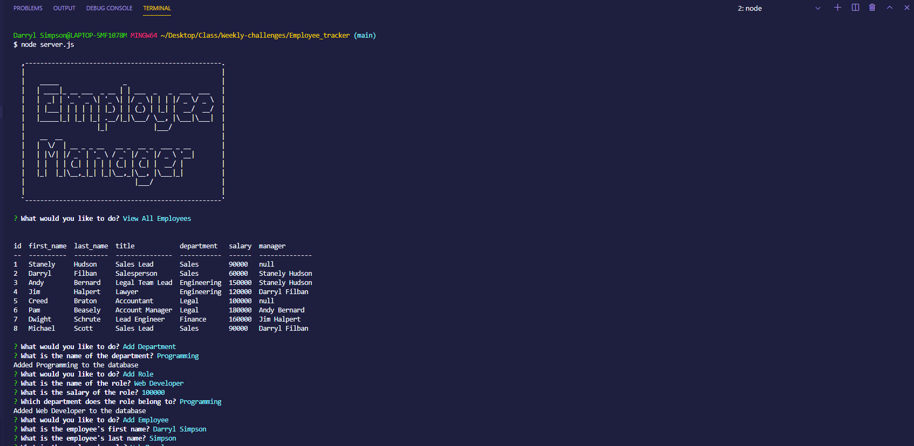
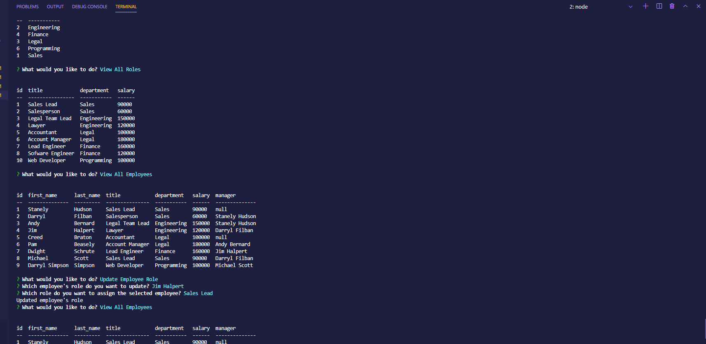

# Employee_tracker

AS A business owner
I WANT to be able to view and manage the departments, roles, and employees in my company
SO THAT I can organize and plan my business

# Table of Contents

 Table of contents

 * [About the Project](#About-The-Project)
    * [Built With](#built-with)

* [Usage](#usage)
    * [Pictures](#pictures)

* [Link to Page](#link-to-page)

* [Contact](#contact)
    * [Creators](#creator)

# About The Project
* GIVEN a command-line application that accepts user input
* WHEN you start the application
* THEN you are presented with the following options: view all departments, view all roles, view all employees, add a department, add a role, add an employee, and update an employee role
* WHEN you choose to view all departments
* THEN you are presented with a formatted table showing department names and department ids
* WHEN you choose to view all roles
* THEN you are presented with the job title, role id, the department that role belongs to, and the salary for that role
* WHEN you choose to view all employees
* THEN you are presented with a formatted table showing employee data, including employee ids, first names, last names, job titles, departments, salaries, and managers that the employees report to
* WHEN you choose to add a department
* THEN you are prompted to enter the name of the department and that department is added to the database
* WHEN you choose to add a role
* THEN you are prompted to enter the name, salary, and department for the role and that role is added to the database
* WHEN you choose to add an employee
* THEN you are prompted to enter the employee’s first name, last name, role, and manager and that employee is added to the database
* WHEN you choose to update an employee role
* THEN you are prompted to select an employee to update and their new role and this information is updated in the database 

## Built With
* [Node](https://nodejs.org/en/)
* [Javascript]()

 ## Packages Used
* [MySQL2](https://www.npmjs.com/package/mysql2)
* [Console.table](https://www.npmjs.com/package/console.table)
* [Inquirer](https://www.npmjs.com/package/inquirer)

# Usage

## Video Instructions
* Click link for video

[![Follow this link to the Walthrough video]](https://drive.google.com/file/d/1nLL1TGVWTWtJuDmmPLJOKhWhHs6Sqecj/view?usp=sharing "video")

## Pictures

# Link to Page

* [Follow this Link to GitHub Repo](https://github.com/DarrylSimpson/Employee_tracker)

# Contact

## Creator

* [Check out my GitHub](https://github.com/DarrylSimpson) , or email me at [Darryl.Simpson0793@gmail.com](mailto:Darryl.Simpson0793@gmail.com)
